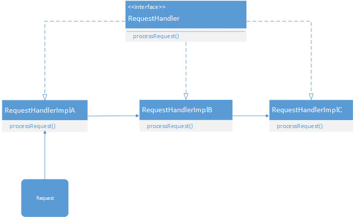

GoF 设计模式
=============

Chain of Responsibility(职责链)
```````````````````````````````````

1.意图
--------------------------------
使多个对象都有机会处理请求，从而避免请求的发送者和接受者之间的耦合关系。将这些对象连成一条链，并沿着这条链传递该请求，指导有一个对象处理它。

2.UML图
--------------------------------
